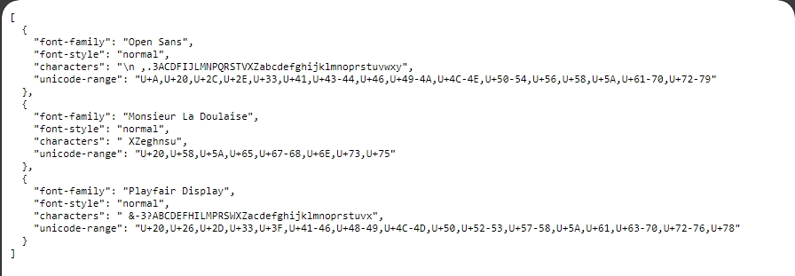

# Web Fonts Unicode Range Ext
Chrome extension to show unicode range of each font on your webpage for creating minimal font subsets

## Installation
1. Clone or download this repo.
2. Go to the Extensions page by entering chrome://extensions in a new tab. Alternatively, click the Extensions menu puzzle button and select Manage Extensions at the bottom of the menu.
Or, click the Chrome menu, hover over More Tools, then select Extensions.
3. Enable Developer Mode by clicking the toggle switch next to Developer mode.
4. Click the Load unpacked button and select the repo directory.

## Usage
Click the extension's action icon; you should see a side panel with unicode range of each fonts in JSON format:
